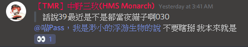

# 鬼厲.87.Ninja

TMR戰隊的隊長，擅長散彈槍與火箭筒。 除了shellshock以外，也有玩戰艦世界，還有貓咪大戰爭，並且將遊玩過程的影片放在youtube上，是個youtuber。本人就是心太軟嘴硬，常常亂搞別人(?
是個JOJO粉，常常會在discord群組裡貼JOJO的梗圖。還是個戰艦迷，非常愛研究戰艦。(我絕對不是蘿莉控

# 幻(IJN Haruna)

TMR戰隊的副隊長，據說一開始是與隊長兩人一起創立TMR的。
擅長狙擊槍(單發)，有時候會在雀姬上打日麻，並且是個經常抽中角色的歐洲人。
玩著食物語，雖然宣稱這是個女性向遊戲卻又喊著好香的人，根據可靠消息幻是男生。
目前的目標是考上科學班。

# L GENM

TMR戰隊內的代理隊長，擅長狙擊槍(單發)。
對狙擊槍有著過人的見解，並且有著理論化的玩法，同時也可以精確看出他人的狙擊槍實力。
可惜的是(或者不可惜?)，是個中二病，詳情請看TMR的youtuber們中的GENM的頻道。
據說有個弟弟，是個電腦大師。

# 中野三玖(HMS Monarch)

TMR戰隊內的代理隊長，擅長衝鋒槍、AK47。
聽名字就知道，是個39派。
是個夜貓子，如果在白天捕捉到的話請通知其餘TMR隊內成員。
有玩碧藍航線、戰艦世界...等遊戲。
有著多次以手槍擊敗衝鋒槍或者AK47的對手，並馬上被指責是Hacker的輝煌紀錄。

# 內藤由保(IJN Mikasa)

TMR戰隊內的聯合艦隊艦長，擅長狙擊槍(單發)與火箭筒與散彈槍。
TMR隊內最活躍的玩家，沒有之一，一天中有三分之二的時間都在線，基本上在線也不是掛機。
同時間玩著許多遊戲，像是戰艦世界、碧藍航線、我的學妹不可能這麼萌2、還有一些我不知道的戰略遊戲(?)。
是學妹2的大佬，收藏了許多可愛妹子圖片。
喜歡紫色。

# 蚵仔煎

TMR戰隊最強成員，幾乎沒有不擅長的槍。
TMR的早期成員之一，同時拉拔了許多戰隊內的中流砥柱，像是內藤、sin......等等。
曾經對戰PLG的領導者，雖敗猶榮，此戰帶動了隊內對技術的激烈討論。
目前已經從Shellshock中退休，有玩皇室、LOL......等遊戲。
是個晚上會去考駕照的男人。

# 其他成員

其他成員之後會再補上 而裡面有30%的大部分都在潛水 50%的偶爾上線 20%的長期上線。